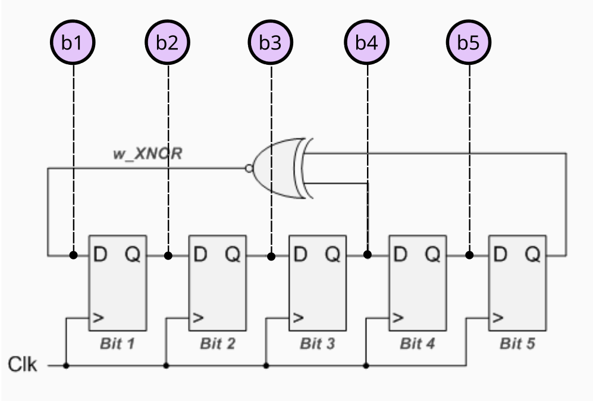
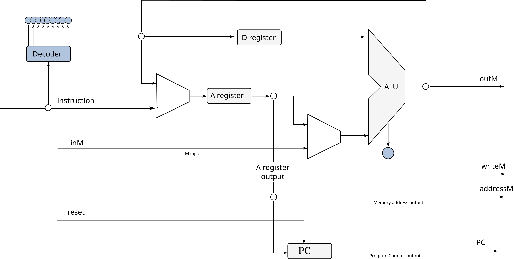

# AV3 - Simulado

Simulado Avaliação 3 - Bits e Proc

Você possui um total de 1h20 para realizar a avaliação, você pode decidir
como usar o seu tempo.

- **NÃO PODE USAR O GITHUB COPILOT**
- **Trabalhar sozinho**
- **1h20 min**
- **REALIZAR UM COMMIT (A CADA QUESTÃO) E DAR PUSH AO FINALIZAR**

## HW

### Teoria

|       | pts HW | pts SW |
|-------|--------|--------|
| papel | 5      |        |

Algo como: 
- - https://docs.google.com/forms/d/e/1FAIpQLSdGuoLR1Re3aok6I6adChgaDuMg0-dJaA7FF2gK5MLIGReg3g/viewform?usp=send_form
- O que é registrador? 
- O que é memória RAM e ROM
- Como a nossa memória RAM foi construída

### Linear-feedback shift register (LFSR)

| Arquivo: `hw/lfsr.py` | pts HW | pts SW |
|-----------------------|--------|--------|
| pytest -k lfsr        | 5      |        |
| Simulacão (papel)     | 5      |        |

LFSR é um shift-register que o bit de entrada é uma função linear de sua saída, pode ser utilizado para gerar uma sequencia a pseudo randômica.



#### Papel

Simule o circuito por 6 clocks, e responda o que acontece com os bits[4:0].

#### MyHDL

Implemente o módulo no arquivo `hw/lfsr.py`, utilize o flip flop tipo D `dff` já definido no arquivo. Considere que o vetor de saída `bits` é composto por `[b5, b4, b3, b2, b1]`.

> tip: use ConcatSignal

``` python
    # considere o sinal de saída bits como sendo do tipo
    bits = Signal(modbv(0))
```

### Z01

|         | pts HW | pts SW |
|---------|--------|--------|
| (papel) | 10      | 5      |

O que acontece com a cpu quando as intrucões a seguir são executadas?

- `leaw $5, %A`
- `addr (%A), $-1, %D`
- `jle`



## Nasm

### 1. (10 SW) pseudo

| Arquivo: `nasm/pseudo.nasm` | pts HW | pts SW |
| --------------------------- | ------ | ------ |
| pytest -k pseudo_if         |        | 5      |
| pytest -k pseudo_else       |        | 5      |

Transcreva para assembly do Z01 o pseudo código a seguir:

```python
; if ( RAM[0] < 2 && RAM[1] == 0 ):
;     RAM[5] = RAM[5] + 1
; else
;     RAM5[5] = RAM[5] - 1
```

### 2. (10 SW / 10 HW) Senha

| Arquivo: `nasm/reta.nasm` | pts HW | pts SW |
| ------------------------- | ------ | ------ |
| pytest -k senha_certo     | 5      | 5      |
| pytest -k senha_errado    | 5      | 5      |

Você foi chamado para desenvolver uma fechadura eletrônica com o processador Z01.

O cliente pediu para a fechadura ter a funcionalidades a seguir:

A senha é definida pelo valor salvo em RAM[0] e o usuário insere uma senha pelas chaves (SW) da placa. O programa deve:

- Em caso da senha estar correta: acender o LED[0]
- Em caso da senha estar errada: acender os LED[2] e LED[1]

### 3. (25 SW) AlTERando CaIxA dE CAraCteRes

| Arquivo: `nasm/uppsercase.nasm`   | pts HW | pts SW |
| --------------------------------- | ------ | ------ |
| Teste 0: string exemplo           |        | 3      |
| Teste 1: string tamanho diferente |        | 17     |
| Teste 2: string com números       |        | 5      |

Você deve desenvolver um programa em assembly que converte
todos os caracteres de uma string para maiúsculo. Conforme
exemplo a seguir:

```
teste 0
   antes          |    depois
                  |
 RAM[8]  = `H`    |     `H`
 RAM[9]  = `e`    |     `E`
 RAM[10] = `L`   ==>    `L`
 RAM[11] = `l`    |     `L`
 RAM[12] =  o`    |      O`
 RAM[13] = 0x00   |    0x00
```

**A string começa na RAM[8] e termina em um NULL**

Dicas:

- Notem que o **A** tem uma distância para o **a** e que se mantém para as outras letras.
- Antes de subtrair o valor da distância da letra, precisa verificar se ela é minuscula.


